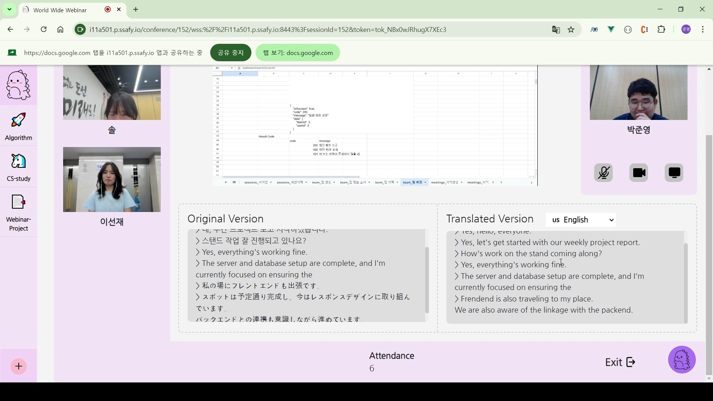
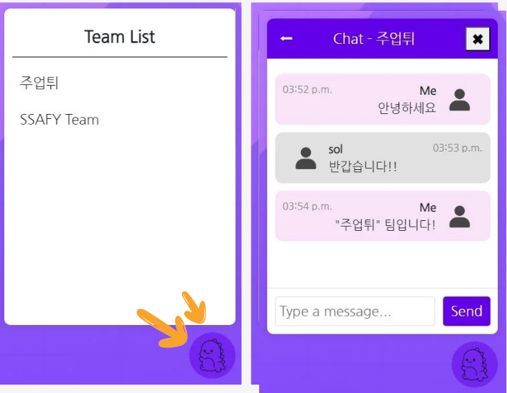
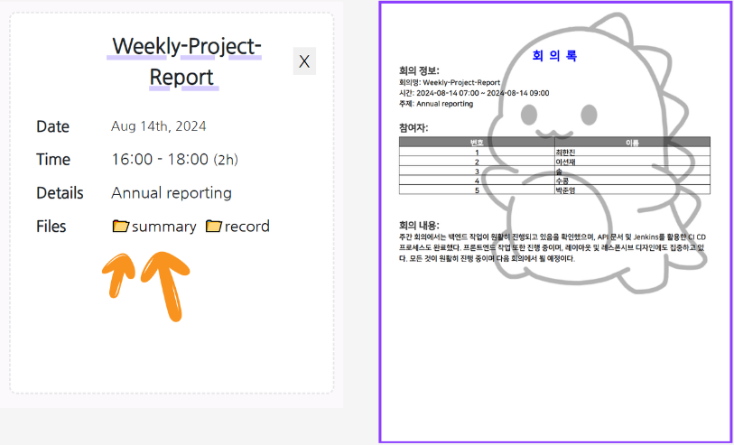
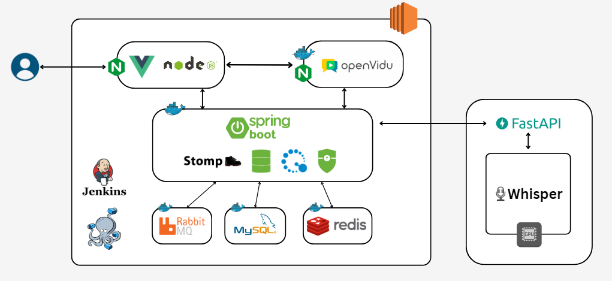

# WWW
> 다국어 실시간 번역 웹 어플리케이션

  

---

## 💡 프로젝트 소개

#### 🛠 핵심 기능

* WebRTC(Openvidu)를 활용한 화상 회의 서비스

* 그래픽 서버에 탑재한 AI 모듈을 활용한 STT 자막/번역 서비스

* 각 팀별 메신저 기능 서비스

* AI를 활용한 요약 회의록 제공 서비스

#### 📢 기능 시연

* 화면 공유, 각자의 음성/화상 공유 가능한 회의

* 팀 선택 후, 팀원간 대화 가능한 메신저

* AI 기반으로 회의 전문을 요약해 제공하는 회의록

---

## 📌 아키텍처/ERD/사용 기술

### 아키텍처

### ERD

### 사용 기술 스택

* FE: Vue3, node.js, HTML, CSS

* BE: Spring, Redis, MySQL, Stomp

* AI: FastAPI, Whisper

* WebRTC: RabbitMQ, Openvidu

* CI/CD: Nginx, Docker, Jenkins, EC2

---

## 👩‍💻 팀원 소개

* 이주영: 팀장, FastAPI 서버를 이용한 STT 자막/번역 처리 AI, BE/FE 전반 보조, CI/CD 와 인프라 전반

* 박준영: FE 리더, Axios 및 Storage 설계, Openvidu FE 컴포넌트, nginx이용 SSL인증서 발급

* 김수빈: BE 리더, RabbitMQ를 활용한 메시지 브로커 설계, DB 설계, Meeting CRUD, AI 요약 회의록 기능

* 이선재: FE, 메인 웹 디자인, Team 삭제/탈퇴 기능, 컴포넌트 템플릿 빌드

* 주연수: BE, Openvidu 서버 세팅/배포, User CRUD/Team CRUD, DB 설계, 팀 페이지 관리

* 권용수: FE, UCC 담당, 채팅 socket 연결, 채팅용 컴포넌트/소통

